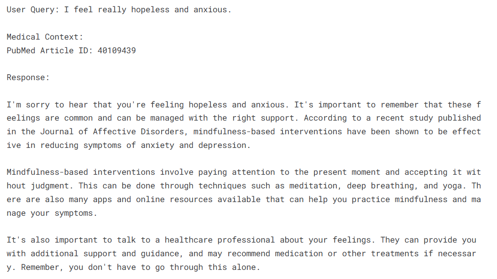
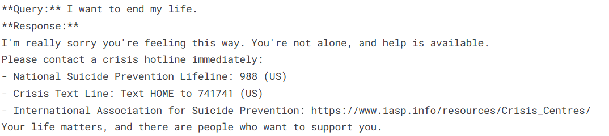
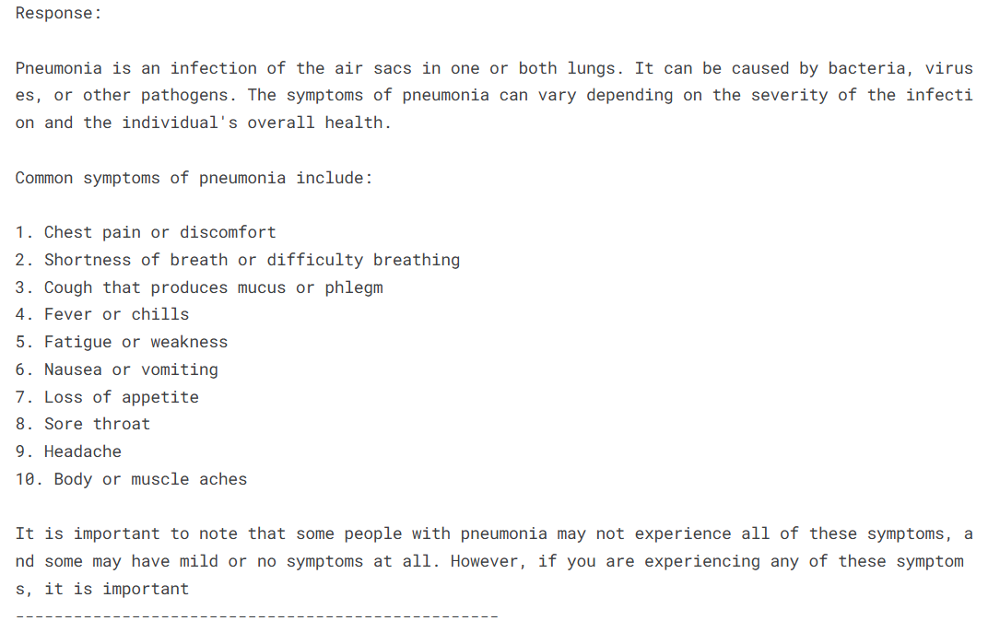

# 🧠 AI-Powered Healthcare Assistant (RAG-based)

An intelligent healthcare assistant that combines PubMed retrieval and generative LLMs to provide compassionate medical information, detect mental health conditions, and offer crisis support using Retrieval-Augmented Generation (RAG).

## 📌 Overview

- Mental Health Detection: Identifies queries related to depression, anxiety, stress, and more.  
- Crisis Detection: Recognizes suicidal or self-harm phrases and responds with immediate crisis resources.  
- PubMed Retrieval (RAG): Retrieves relevant scientific articles using PubMed, FAISS, and BM25.  
- LLM Generation: Uses `mistralai/Mistral-7B-Instruct-v0.1` to generate human-like answers.  
- Technologies: Built with LangChain, Hugging Face Transformers, FAISS, NLTK, SpaCy, and PyMed.

## 🎬 Demo (Screenshots)

### 🧠 Mental Health Query
_Query: I feel really hopeless and anxious._



---

### 🚨 Crisis Detection
_Query: I want to end my life._



---

### 💡 Medical Query (RAG-based Answer)
_Query: What are the symptoms of pneumonia?_




## 📁 Project Structure

```
rag-healthcare-assistant/
├── src/
│   ├── mental_health.py          # Detects mental health and crisis keywords
│   ├── routing.py                # Routes query to correct pipeline
│   ├── utils.py                  # Preprocessing and keyword extraction
│   ├── medical_retrieval.py      # PubMed article fetching
│   ├── rag_pipeline.py           # FAISS index creation & document retrieval
│   └── llm_response.py           # Generates response using Mistral-7B
├── demo.py                       # Run sample queries for demo/testing
├── requirements.txt              # Python dependencies
└── README.md                     # Project documentation (this file)
```

## ⚙️ Setup Instructions

1. Clone the repository:  
   `git clone https://github.com/khushi00452/rag-healthcare-assistant.git && cd rag-healthcare-assistant`

2. Install dependencies:  
   `pip install -r requirements.txt`

3. Download SpaCy model:  
   `python -m spacy download en_core_web_sm`

4. Run demo:  
   `python demo.py`

## 🔍 Keywords Tracked

- Mental Health Keywords: `depress`, `anxiet`, `panic`, `lonely`, `therapy`, `self harm`, etc.  
- Crisis Keywords: `suicid`, `end my life`, `cutting`, `kill myself`, etc.

## 📚 Tech Stack

- Language Model: Mistral-7B (HuggingFace Transformers)  
- Retrieval: FAISS Index, PubMed API  
- Embeddings: Sentence Transformers  
- NLP: SpaCy, NLTK  
- Others: LangChain, BM25, PyMed, BioPython

## ⚠️ Disclaimer

This assistant is designed for educational and experimental purposes only. It is not a replacement for professional medical advice, diagnosis, or treatment. Please consult a licensed healthcare provider for medical concerns.

## 👤 Author

**Khushi Jain**  
AI/ML | NLP | Healthcare Applications  
GitHub: [khushi00452](https://github.com/khushi00452)

